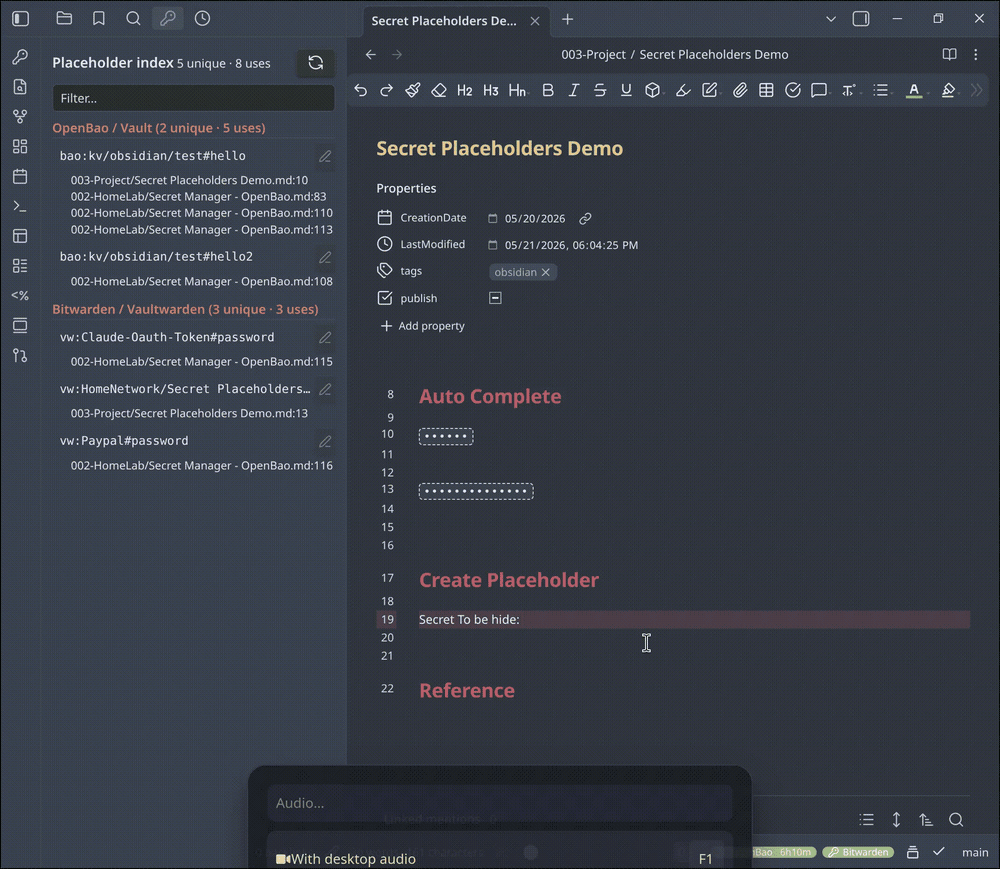
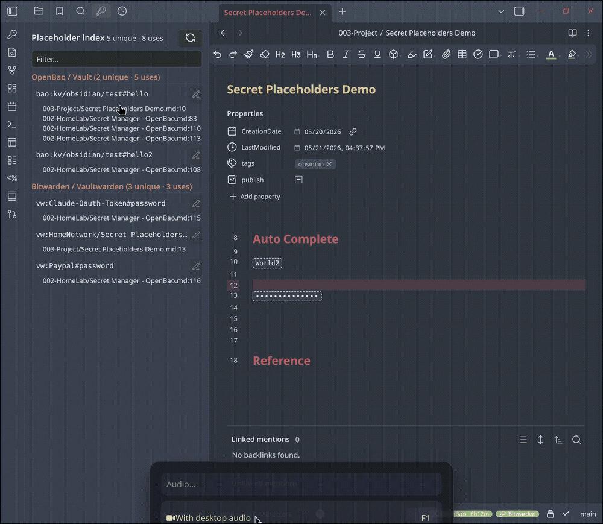

# Secret Placeholders

An Obsidian plugin that lets your notes **reference** secrets from a
password manager instead of **containing** them. The `.md` file on disk
holds only a placeholder like `{{bao:kv/personal/github#token}}`; the
real value is fetched from your password manager and shown inline only
inside Obsidian.

---

## Table of contents

- [The problem](#the-problem)
- [How it works](#how-it-works)
- [Demos](#demos)
- [Supported backends](#supported-backends)
- [Installation](#installation)
- [Quick start](#quick-start)
- [Provider setup](#provider-setup)
  - [OpenBao / HashiCorp Vault](#openbao--hashicorp-vault)
  - [1Password Connect](#1password-connect)
  - [Bitwarden / Vaultwarden](#bitwarden--vaultwarden)
- [Placeholder syntax](#placeholder-syntax)
- [Using the plugin](#using-the-plugin)
  - [Rendering & masking](#rendering--masking)
  - [Click actions](#click-actions)
  - [Autocomplete](#autocomplete)
  - [Right-click menu](#right-click-menu)
  - [The sidebar index](#the-sidebar-index)
  - [Commands](#commands)
- [Settings reference](#settings-reference)
- [Security model](#security-model)
- [Network use](#network-use)
- [Known limitations](#known-limitations)
- [Troubleshooting](#troubleshooting)
- [Contributing a provider](#contributing-a-provider)
- [License](#license)

---

## The problem

Plenty of people now let LLM agents manage their Obsidian vault — reading
notes, refactoring, summarising, generating content. That is fine until
the vault holds credentials: an API token jotted into a project note, a
database password in a runbook, a recovery key in a personal note.

The usual workaround is to keep secrets in a separate password manager.
But then any note that *refers* to a secret is half-broken — you can't
see the value while reading or editing the note, so you end up pasting it
back in "just for now," and it never leaves.

**Secret Placeholders closes that loop.** The note keeps a small
placeholder. The plugin resolves it to the live value at render time and
shows it inline. The result:

| Who / what | Sees |
|---|---|
| You, in Obsidian | the real secret value |
| An LLM agent reading the vault | only `{{bao:...}}` — a path, not a value |
| Git history, backups, sync | only the placeholder |
| Anyone you share the raw `.md` with | only the placeholder |

The secret value is **never written to the `.md` file**. It lives in your
password manager; the plugin only borrows it into memory while Obsidian
displays the note.

---

## How it works

1. You run a password manager — OpenBao/Vault, 1Password Connect, or
   Bitwarden/Vaultwarden — and log the plugin into it.
2. In a note you write a placeholder where a secret should appear:
   `API token: {{vw:Work/CI Server#password}}`.
3. In Reading mode and Live Preview the placeholder renders as the real
   value (or a masked dot-string, your choice). The underlying file is
   untouched.
4. To store a *new* secret, select the value in a note and run
   **Save selection as secret** — the plugin writes it to your password
   manager and replaces the selection with a placeholder.

Rendering is strictly display-only. The Reading-mode post-processor and
the Live Preview decoration never write to the vault. The only actions
that modify a note are ones you explicitly trigger (insert placeholder,
save selection, replace inline).

---

## Demos

**Autocomplete** — type `{{`, pick a provider, then fuzzy-search your
secrets. Selecting one inserts the full placeholder.


**Save a selection as a new secret** — select a credential in a note and
save it straight to your password manager. The value leaves the note;
only the placeholder stays behind.



**Edit a secret's value** — change the stored value from inside Obsidian.
The backend secret updates; the placeholder text in the note is
untouched.



---

## Supported backends

| Backend | Status | Auth | Notes |
|---|---|---|---|
| OpenBao / HashiCorp Vault | Supported | Token, or OIDC browser login (desktop) | KV v2 engine |
| 1Password Connect | Supported | Connect token | Needs a self-hosted Connect server (1Password Business/Teams) |
| Vaultwarden / Bitwarden self-hosted | Supported | Master password | PBKDF2 + Argon2id; TOTP 2FA |
| Bitwarden cloud | Supported | Master password | Same provider; point the server URL at `vault.bitwarden.com` |

Each backend has its own placeholder prefix: `bao:`, `1p:`, `vw:`. You
can enable any subset in Settings — disable the ones you don't use and
their UI disappears entirely.

---

## Installation

### From the Obsidian community store

Once the plugin is accepted into the community store: *Settings →
Community plugins → Browse → search "Secret Placeholders" → Install →
Enable*.

### Manual install

1. Download `manifest.json`, `main.js`, and `styles.css` from the latest
   [GitHub release](https://github.com/lai2301/obsidian-secret-placeholders/releases).
2. Copy them into `<your-vault>/.obsidian/plugins/secret-placeholders/`.
3. *Settings → Community plugins* → enable **Secret Placeholders**.

### From source

```bash
git clone https://github.com/lai2301/obsidian-secret-placeholders
cd obsidian-secret-placeholders
npm install
npm run build      # produces main.js
```

Then copy `manifest.json`, `main.js`, `styles.css` into the plugin folder
as above. `scripts/deploy.sh` automates the copy — see the script header.

---

## Quick start

1. Enable the plugin.
2. Open *Settings → Secret Placeholders*. Under **Providers**, turn off
   any backend you don't use.
3. Configure the backend you do use (see [Provider setup](#provider-setup))
   and log in. The status-bar chip turns lit when login succeeds.
4. In a note, type `{{` and pause — autocomplete offers your providers
   and, once you pick one, your secrets.
5. The placeholder renders inline. Single-click it to copy the value.

To capture a new secret: select a credential value in a note,
right-click → **Save selection to <provider>**.

---

## Provider setup

### OpenBao / HashiCorp Vault

The plugin uses the **KV v2** secrets engine.

**Settings** (*Settings → Secret Placeholders → OpenBao / Vault*):

| Field | Meaning |
|---|---|
| Server address | Base URL of your OpenBao/Vault server, e.g. `https://openbao.example.com` |
| OIDC role | The `oidc` auth role to use for browser login |
| Default mount | KV mount name (default `kv`) |
| Default path prefix | Prepended to suggested paths when saving (default `obsidian/`) |
| Cache TTL | Seconds a resolved secret stays in memory |
| Remember token | Encrypt the token on disk behind a passphrase |

**Logging in:**

- **Desktop** — click *Log in*. The plugin opens your identity provider
  in the system browser, captures the callback on `127.0.0.1`, and
  exchanges it for a Vault token. This is the same loopback flow the
  `bao`/`vault` CLI uses.
- **Mobile**, or as a fallback — click *Paste token* and paste a token
  obtained from `bao login` or the Vault web UI.

Server-side, you need a KV v2 mount and (for browser login) an `oidc`
auth role whose policy permits read/write on your secret paths. Minimal
example:

```bash
bao secrets enable -path=kv -version=2 kv

bao policy write obsidian - <<'EOF'
path "kv/data/obsidian/*"     { capabilities = ["create","read","update","delete","list"] }
path "kv/metadata/obsidian/*" { capabilities = ["read","list","delete"] }
path "auth/token/lookup-self" { capabilities = ["read"] }
path "auth/token/renew-self"  { capabilities = ["update"] }
EOF
```

### 1Password Connect

1Password Connect is a **self-hosted API gateway** in front of your
1Password account. It requires a 1Password **Business or Teams** plan —
Connect is not available on personal/family plans, and the plugin cannot
talk to 1Password without a Connect server.

1. In the 1Password admin: *Integrations → 1Password Connect Server →
   set up a new server*. Grant it access to the vaults you want to
   expose. Download `1password-credentials.json` and copy the **access
   token** shown on the same screen.
2. Run a Connect server with that credentials file (`connect-api` +
   `connect-sync` containers — see `dev/docker-compose.1p.yaml`).
3. In the plugin's **1Password Connect** settings, set the **Connect
   server URL**, a **default vault** name, and paste the **access
   token**.

Connect only sees the vaults you granted during setup. Items in your
*personal* vault are visible; org-shared vaults that weren't granted are
not.

### Bitwarden / Vaultwarden

One provider serves three things, differing only by server URL:

| Target | Server URL |
|---|---|
| Vaultwarden (self-hosted) | your instance, e.g. `https://vw.example.com` |
| Bitwarden cloud (US) | `https://vault.bitwarden.com` |
| Bitwarden cloud (EU) | `https://vault.bitwarden.eu` |

**Settings** (*Settings → Secret Placeholders → Bitwarden / Vaultwarden*):

| Field | Meaning |
|---|---|
| Server URL | as above |
| Email | your Bitwarden account email |
| Cache TTL | seconds the decrypted item list stays in memory |
| Remember session | persist the session encrypted on disk (see below) |

**Logging in:** click *Log in*, enter your email and master password.
The master password is used **locally** to derive your keys — only a
derived hash is sent to the server, never the password itself.

First login from a new device may trigger two extra prompts:

- **New-device verification** — Bitwarden cloud emails a 6-digit code.
- **Two-factor (TOTP)** — if 2FA is enabled, enter the code from your
  authenticator app.

**Remember session:** when on, the plugin encrypts your account's
encryption key and refresh token on disk under a passphrase you choose.
On the next Obsidian start it asks for that passphrase instead of your
master password. Off by default.

---

## Placeholder syntax

Every placeholder is ``. The reference shape
depends on the provider.

| Provider | Syntax | Example |
|---|---|---|
| OpenBao | `{{bao:<mount>/<path>#<key>}}` | `{{bao:kv/obsidian/github#token}}` |
| 1Password | `{{1p:<vault>/<item>#<field>}}` | `{{1p:Personal/GitHub#password}}` |
| Bitwarden | `{{vw:[<folder>/]<item>#<field>}}` | `{{vw:Work/CI#password}}` or `{{vw:GitHub#password}}` |

Notes:

- The Bitwarden **folder** segment is optional — `{{vw:GitHub#password}}`
  works for a root-level item.
- The **field** part selects which value on the item to show: `password`,
  `username`, `notes`, or any custom field label.
- References are matched **case-insensitively** but otherwise exactly. An
  item titled `GitHub - Personal` is not matched by `{{vw:GitHub#...}}`.
- A `/` inside an item title breaks the syntax (the first `/` is the
  folder separator). Rename the item, or reference it by its provider
  UUID instead of its name.
- Existing `{{bao:...}}` notes from earlier plugin versions keep working
  unchanged.

---

## Using the plugin

### Rendering & masking

Placeholders render in both **Reading mode** and **Live Preview**. In
Live Preview the placeholder text is hidden behind a widget; moving the
text cursor into it reveals the raw `{{...}}` so you can edit it.

The **Mask mode** setting controls how a resolved value is shown:

- **Never** (default) — the value is shown in clear text once resolved.
  The on-disk file still contains only the placeholder; masking is purely
  a shoulder-surfing / screen-share concern.
- **Always** — the value is always shown as dots.
- **Manual** — masked by default; click to reveal individually.

While a secret is being fetched a small spinner shows. If a fetch fails
the placeholder shows `[secret: error]`; hover for the reason. When the
failure is an auth error, an inline **Re-login** button appears.

### Click actions

Single-click and modifier-click (Ctrl/Cmd-click) on a resolved
placeholder are independently configurable:

- **Copy** (default for single-click) — copies the value to the clipboard.
- **Toggle mask** (default for modifier-click) — flips this placeholder
  between masked and revealed.
- **Do nothing**.

### Autocomplete

Typing `{{` in the editor triggers suggestions:

- `{{` alone → a picker of your enabled providers. Choosing one fills in
  `{{<prefix>:` and continues into that provider's secret list.
- `{{<text>` (no colon yet) → a fuzzy search across **every** enabled
  provider's secrets at once, each result labelled with its provider.
- `{{<prefix>:<query>` → the usual per-provider filtered list.

### Right-click menu

**Right-click on selected text** → *Save selection to <provider>* (one
item per enabled provider). Writes the selected text to that provider as
a new secret and replaces the selection with a placeholder.

**Right-click on a rendered placeholder** →

- **Copy resolved value** — clipboard only, no file change.
- **Edit secret value…** — opens a modal to change the stored value in
  the password manager. The placeholder text in the note does not change;
  only the backend secret does. You can optionally reveal the current
  value before overwriting it.
- **Replace with resolved value…** — replaces the placeholder text in the
  note with the actual secret. This *writes the secret to the `.md` file*
  and defeats the plugin's purpose, so it is gated behind a confirmation
  modal with a masked preview. Use it only when you deliberately want the
  raw value in the file.

### The sidebar index

The ribbon icon (and the command *Secrets: Open placeholder index*)
opens a sidebar view that scans every markdown file in the vault for
placeholders and lists them grouped by provider → unique placeholder →
usage site.

- Click a usage row to jump to that note with the cursor on the line.
- Hover a placeholder row and click the pencil to **edit the secret
  value** for it.
- The filter box narrows the tree; the refresh button re-scans. The
  index also rebuilds automatically (debounced) when vault files change.

### Commands

All commands are under the `Secrets:` prefix in the command palette:

| Command | Action |
|---|---|
| Login to active provider | Start the active provider's login flow |
| Logout of active provider | Clear the active provider's session |
| Clear cache | Drop all in-memory resolved secrets |
| Save selection as secret | Write the selected text to a provider |
| Insert placeholder | Insert a placeholder via a location modal |
| Browse and insert placeholder | Fuzzy-pick an existing secret to insert |
| Browse and copy value | Fuzzy-pick a secret and copy its value |
| Copy secret under cursor | Copy the value of the placeholder at the cursor |
| Open placeholder index | Open the sidebar index view |

---

## Settings reference

**Display**

- **Mask mode** — `never` / `always` / `manual`.
- **Click action** / **Modifier-click action** — `copy` / `toggle-mask` /
  `none`.
- **Mask character** — the character used when masking.

**Providers**

- One enable/disable toggle per backend. A disabled provider contributes
  no settings, no status-bar chip, no placeholder rendering, no
  autocomplete.
- **Status bar** — choose which providers show a chip. Leave all
  unchecked to show every enabled provider.

**Per provider** — see [Provider setup](#provider-setup).

---

## Security model

- **The `.md` file never contains the secret value.** It contains only
  the placeholder text. This holds for the file on disk, in git, in
  backups, and in anything that reads the raw file.
- **Resolved values live in memory only**, in a cache with a configurable
  TTL. *Clear cache* and logout drop them.
- **Tokens / sessions** are kept in memory by default. The optional
  "remember on device" settings encrypt them at rest with AES-GCM, using
  a key derived from a passphrase you choose (PBKDF2-HMAC-SHA256, 200,000
  iterations). The passphrase is never stored.
- **Bitwarden master password** is used only locally to derive keys.
  Only a derived password hash is sent to the server; the password
  itself never leaves your device. All client crypto (PBKDF2, Argon2id,
  HKDF, AES-CBC-HMAC) runs in WebCrypto / WASM on your device.
- The rendering paths are **display-only** and cannot modify a note.
  Only explicit user commands write to a file, and the one that writes a
  raw secret (*Replace with resolved value*) is confirmation-gated.

If you publish notes from your vault, also strip placeholders in your
publish pipeline as defense-in-depth — a leaked placeholder reveals a
secret *path*, not its value, but paths can still be sensitive.

---

## Network use

The plugin makes network requests **only to the server URLs you
configure** — your OpenBao server, your 1Password Connect server, your
Bitwarden/Vaultwarden server. It never contacts an author-controlled or
third-party endpoint, sends no telemetry, and bundles no analytics.

All requests go through Obsidian's `requestUrl`, so they work on desktop
and mobile without CORS configuration on the backend.

The OpenBao OIDC browser-login flow (desktop only) starts a short-lived
loopback HTTP listener on `127.0.0.1` to catch the OAuth redirect, then
shuts it down. This is the standard OAuth loopback pattern and is guarded
to desktop builds only.

---

## Known limitations

- **Bitwarden organisations** — only your *personal* vault is supported.
  Items owned by a Bitwarden organisation are encrypted with a separate
  org key the plugin does not yet unlock, so they will not resolve.
- **Bitwarden 2FA** — TOTP (authenticator app) only. Email, Duo, and
  WebAuthn second factors are not supported; switch the account to TOTP
  to use the plugin.
- **Bitwarden cipher format** — only the current EncString type
  (`AesCbc256_HmacSha256`) is read. Very old items may need re-encrypting
  via an official Bitwarden client.
- **1Password** requires a self-hosted Connect server and a Business or
  Teams plan.
- **OIDC browser login** for OpenBao is desktop-only. Mobile uses
  paste-token.
- **Replace with resolved value** in Reading mode replaces the first
  occurrence of the placeholder in the active file.
- **One account per provider.** Two OpenBao servers, or a personal plus a
  work 1Password, are not supported simultaneously.

---

## Troubleshooting

| Symptom | Likely cause |
|---|---|
| `[secret: error]` with a Re-login button | Not logged in, or the session expired. Click Re-login. |
| `[secret: error]`, tooltip says "not found" | The reference doesn't match an item exactly (case aside), or the item is in an unsupported location (Bitwarden org vault, 1Password vault not granted to Connect). |
| Autocomplete after `{{vw:` shows nothing | Logged in but the item list is empty — check the item is in your personal vault and is a login or secure-note item. |
| Spinner never resolves | Network failure reaching the server URL — verify the URL and that the server is reachable from your device. |
| Bitwarden login fails: "unsupported KDF" | Older plugin builds only — update the plugin; Argon2id is supported. |

The command *Secrets: Clear cache* forces a fresh fetch without
restarting Obsidian.

---

## Contributing a provider

A backend is a single module implementing the `Provider` interface in
`src/providers/types.ts`: parse/format a placeholder, read/write/list
secrets, and an auth handle. Register it in `src/main.ts`. The OpenBao
provider in `src/providers/openbao/` is a compact reference; the
rendering, autocomplete, sidebar, and command code are all
provider-agnostic and need no changes to support a new backend.

Build with `npm run build`; type-check with `npm run typecheck`.

---

## License

MIT — see [LICENSE](LICENSE).
